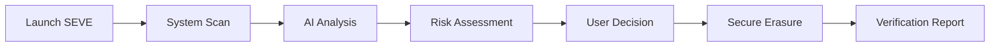

<table style="background: #1a1a1a; width: 100%; border: none; padding: 30px 0;" border="0">
<tr>
<td style="text-align: center; vertical-align: middle; padding: 20px;">

</td>
<td style="text-align: left; vertical-align: middle; color: white; padding: 20px;">
<h1 style="color: #ffffff; font-size: 4em; margin: 0; font-weight: bold; letter-spacing: 0.1em;">SEVE</h1>
<h3 style="color: #cccccc; font-size: 1.2em; margin: 10px 0; font-weight: normal; letter-spacing: 0.05em;">
<strong>S</strong>ECURE <strong>E</strong>RASURE & <strong>V</strong>ERIFICATION <strong>E</strong>NGINE
</h3>
</td>
</tr>
</table>

<h3 style="margin: 0; font-weight: normal; font-size: 1.3em;">
A Fully Offline Secure Data Wiping & Certification System
</h3>

**AI-Powered Storage Intelligence | Enterprise-Grade Data Erasure | Zero-Trust Security**

[Features](#-features) • [How It Works](#-how-it-works) • [Pricing](#-pricing) • [Get Started](#-get-started)

---

## 🎯 The Problem

Every day, millions of devices are resold, recycled, or repurposed with **sensitive data still recoverable**. Standard deletion methods—file deletion, formatting, factory resets—don't actually erase data from modern SSDs due to:

- **Hidden storage areas** and reserved blocks
- **Wear-leveling algorithms** that move data invisibly
- **Controller-level caching** that persists after "deletion"
- **Partition remnants** from development, gaming, and financial activities

**The result?** Users unknowingly expose personal data, corporate secrets, and financial information when they think their devices are clean.

---

## 💡 The SEVE Solution

SEVE is the **first AI-powered storage intelligence platform** that doesn't just erase data—it **understands your system**, identifies hidden risks, and provides **forensic-level secure erasure** with complete verification.

### Why SEVE is Different

| Traditional Tools | SEVE |
|------------------|------|
| ❌ Blind deletion without context | ✅ AI-driven storage analysis |
| ❌ No visibility into what's being erased | ✅ Interactive risk assessment |
| ❌ Unreliable on modern SSDs | ✅ Hardware-level bit-by-bit erasure |
| ❌ No verification or reporting | ✅ Certified erasure reports |
| ❌ One-size-fits-all approach | ✅ Personalized recommendations |

---

## ✨ Features

### 🤖 **AI Storage Intelligence**
- Analyzes your system usage patterns (development, gaming, finance)
- Identifies sensitive data locations across all partitions
- Predicts storage health and failure risks using SMART data
- Provides actionable insights before any erasure

### 🔒 **Forensic-Grade Secure Erasure**
- Hardware-level bit-by-bit overwriting
- Compliant with DoD 5220.22-M, NIST 800-88, and GDPR standards
- Works on SSDs, HDDs, NVMe drives, and external storage
- Bypasses wear-leveling and hidden areas

### 📊 **Real-Time Dashboard**
- Visual storage health metrics
- Security risk scoring
- Application behavior analysis (IDEs, browsers, game launchers)
- Storage optimization recommendations

### 📄 **Certified Reporting**
- Structured erasure verification reports
- Audit-ready documentation for compliance
- Timestamped proof of secure deletion
- Export in PDF, JSON, or CSV formats

### 🔐 **Privacy-First Architecture**
- 100% offline operation—no cloud dependencies
- Admin-level privileges for complete disk access
- Zero data transmission to external servers
- Open-source core for transparency

---

## 🔄 How It Works

1. **Launch with Admin Rights** - SEVE requires elevated privileges for deep disk access
2. **Intelligent Discovery** - Scans all connected drives, partitions, and storage devices
3. **AI-Powered Analysis** - Asks contextual questions about your usage patterns
4. **Risk Visualization** - Displays security risks, sensitive data locations, and health metrics
5. **Targeted Erasure** - Choose what to erase with confidence
6. **Verification & Reporting** - Receive certified proof of secure deletion

---

## 💼 Pricing

| **Free** | **Professional** | **Enterprise** |
|:--------:|:----------------:|:--------------:|
| Basic storage scan | ✅ All Free features | ✅ All Pro features |
| Health monitoring | AI-powered analysis | Multi-device management |
| Standard erasure | Forensic-level erasure | Custom compliance policies |
| - | Certified reports | Priority support |
| - | 5 devices | Unlimited devices |
| **$0/month** | **$9.99/month** | **Contact Sales** |
| [Get Started](#) | [Start Free Trial](#) | [Contact Us](#) |

### 🎁 **Special Offer**
- 30-day free trial for Professional tier
- Educational discounts available
- Volume licensing for enterprises

---

## 🏗️ Architecture

SEVE is built as a **native desktop application** with three core modules:

- **SEVE_Core** - Python-based engine for disk operations and secure erasure
- **SEVE_AI** - Machine learning models for pattern analysis and risk detection
- **SEVE_Web** - Modern React-based dashboard for visualization

### Tech Stack

- **Backend**: Python 3.12, Native OS APIs
- **AI/ML**: TensorFlow, scikit-learn, NLP models
- **Frontend**: React, Vite, TailwindCSS
- **Security**: AES-256, SHA-512, Hardware RNG

---

## 🎯 Use Cases

### 🏢 **Enterprise IT**
- Secure device decommissioning
- GDPR/HIPAA compliance
- Asset lifecycle management

### 💻 **Developers**
- Clean development environments
- Remove cached credentials
- Optimize storage performance

### 🎮 **Gamers**
- Reclaim storage from old games
- Remove shader caches
- Prepare systems for resale

### 💰 **Financial Professionals**
- Erase transaction records
- Remove cached banking data
- Secure tax document deletion

---

## 🛡️ Security & Compliance

SEVE meets industry standards for secure data erasure:

- ✅ **DoD 5220.22-M** - US Department of Defense standard
- ✅ **NIST SP 800-88** - Guidelines for Media Sanitization
- ✅ **GDPR Article 17** - Right to erasure compliance
- ✅ **ISO/IEC 27001** - Information security management

---

## 📚 Documentation

- [User Guide](./docs/user-guide.md)
- [API Reference](./docs/api.md)
- [Security Whitepaper](./docs/security.md)
- [Compliance Certifications](./docs/compliance.md)

---

## 👥 Meet the Developers

### The team behind SEVE

<table align="center">
<tr>
<td align="center" width="25%">
<h3>Utsav Singh</h3>

</td>
<td align="center" width="25%">
<h3>Om Singh</h3>

</td>
<td align="center" width="25%">
<h3>Vikas Tiwari</h3>

</td>
<td align="center" width="25%">
<h3>Reetika Yadav</h3>

</td>
</tr>
</table>

---

## 📞 Contact Us

- 📧 Email: seve.engine@gmail.com

## 📄 License

SEVE Core is licensed under the MIT License. See [LICENSE](./LICENSE) for details.

AI models and enterprise features require a commercial license.

---

**Built with ❤️ by DeadCode Labs for KNOWCODE 3.0**

⭐ **Star us on GitHub** if SEVE helps secure your data!

